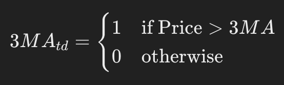
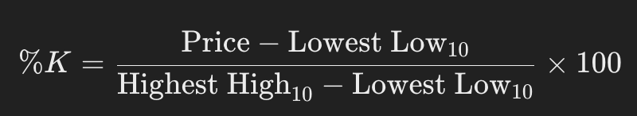
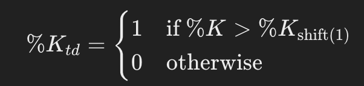
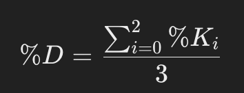
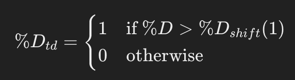
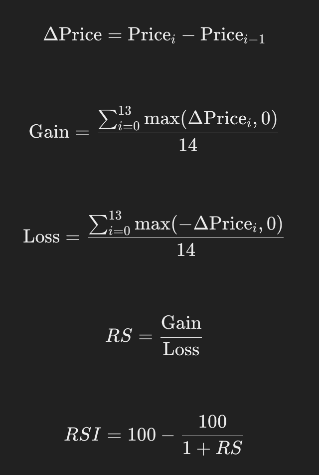
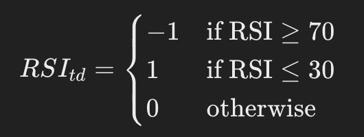
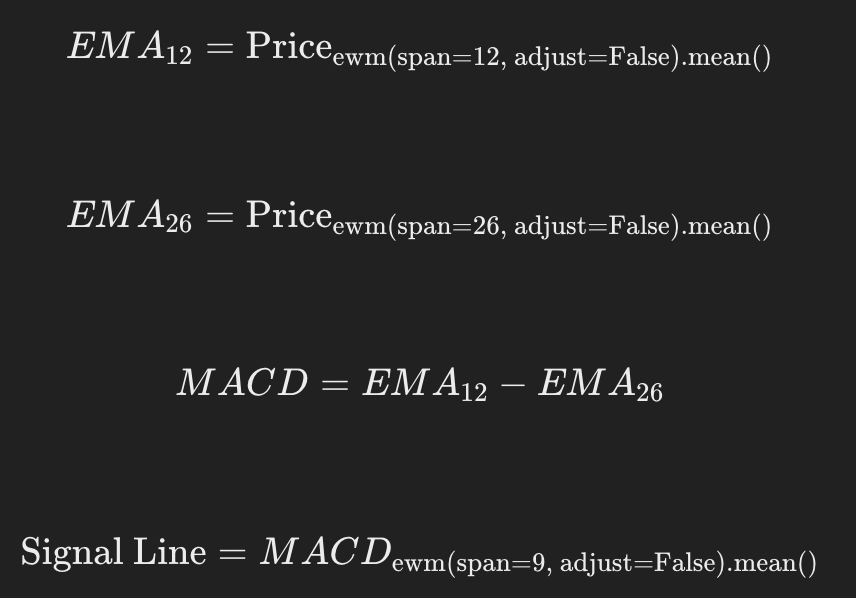
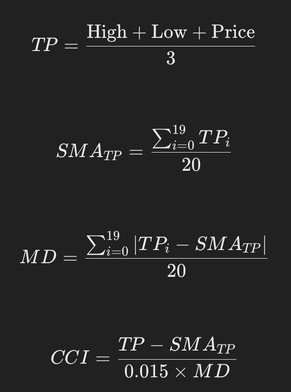
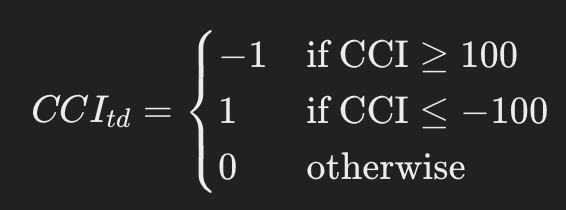

# Predicing BTC, ETH, and SOL Prices using multivariate feature set inlcuding social media sentiment analysis: A machine learning approach

## Literature Review

Predicting stock prices is not only multifaceted but also regarded as one of the most challenging applications of time-series analysis (Kara et al., 2011). Despite the extensive empirical research on predicting stock prices, the literature specifically addressing crypto stock price predictions remains significantly less developed. Accurate and robust stock price predictions are of utmost importance for developing effective trading strategies (Leung, Daouk, & Chen, 2000).

This literature review will focus on past works and attempts at predicting both stock and cryptocurrency prices. We will also delve into the theoretical backgrounds regarding the feasibility of predicting stock prices, examining past attempts by analyzing their methodologies and the machine learning (ML) and deep learning (DL) methods employed. These papers utilized nuanced feature sets, including various market variables. Therefore, we will review literature that explores which feature sets were used and why.
Additionally, this review aims to shed light on the impact of marketing-related variables on the predictive power of stock and crypto markets. In particular, we will investigate the influence of social media sentiment, such as Reddit discussions, on cryptocurrency prices. This comprehensive review seeks to provide a deeper understanding of the methodologies and variables that contribute to the predictability of financial markets.

### Efficient market hypothesis
Eugene Fama's Efficient Market Hypothesis (EMH) asserts that stock prices reflect all available information, implying that they always trade at their fair value (Fama, 1970). According to this theory, since all new information is immediately incorporated into stock prices, consistently predicting market movements or outperforming the market through traditional stock-picking is essentially impossible. This underpins the argument for passive index fund investing, which aims to match market returns rather than exceeding them.
Behavioral finance challenges Eugene Fama's Efficient Market Hypothesis by arguing that psychological factors and irrational behavior of investors can lead to market inefficiencies. Scholars like Daniel Kahneman and Amos Tversky, who developed prospect theory, demonstrate that cognitive biases such as overconfidence and loss aversion significantly influence investor decisions, often leading to predictable and systematic errors (Kahneman & Tversky, 1979). These biases can cause stock prices to deviate from their true values, creating opportunities for superior returns through strategic trading, contrary to EMH’s assertion that such opportunities are fleeting or non-existent. Behavioral finance thus provides a framework to understand why and how markets might not be entirely efficient.
In 2022, Ho-Jun Kang and his colleagues conducted research to investigate the presence of the Efficient Market Hypothesis (EMH) in the cryptocurrency market. Their study involved testing 893 cryptocurrencies, and the results revealed that only a small fraction of these currencies adhered to the EMH. Specifically, only 54 cryptocurrencies (6%) followed the weak-form EMH, and just 24 (3%) adhered to the semi-strong-form EMH. These findings suggest that the cryptocurrency market demonstrates limited efficiency in information processing. Moreover, the study concluded that most cryptocurrencies do not incorporate past prices or new information into their market prices (Kang et al., 2022).

In 2020, Vu Le Tran authored a paper examining the Efficient Market Hypothesis (EMH) within the cryptocurrency market. The study concluded that market efficiency is highly variable over time, particularly noting significant inefficiencies before 2017. Tran observed that, over time, the cryptocurrency market is becoming increasingly efficient. Among the cryptocurrencies tested, Litecoin emerged as the most efficient, while Ripple was identified as the least efficient (Tran, 2020).

### Past attempts at predicting the stock/crypto currency market 
In the study conducted by Kara, an artificial neural network (ANN) and support vector machine (SVM) were employed to predict stock price movements on the Istanbul Stock Exchange. The independent variable in this research was a binary indicator reflecting whether the stock price would move up or down the following day. Their findings revealed that the SVM, particularly with a polynomial activation function, outperformed all other algorithms, including ANN and backpropagation network (BPN), achieving an accuracy of 71.5%. The feature set for this study comprised various technical analysis (TA) indicators such as the Moving Average Convergence Divergence (MACD), Moving Average (MA), and the stochastic oscillator %K (K%) (Kara, 2011).
In another study focusing on trend deterministic data for stock price prediction, a classification model was used to forecast the up or down movement of stock prices. This research incorporated a feature set consisting of binary variables indicating whether a technical indicator suggested an upward or downward trend. The highest performing model in this study was the random forest, which achieved an accuracy of 83.5%. However, a noted limitation of this approach was the binary nature of the technical indicators. The study suggested that incorporating additional levels to represent the degree of movement, such as 'slightly up', 'slightly down', and 'barely down', could enhance the model's accuracy (Patel, 2015).

In 2020, Chen conducted a study to predict Bitcoin prices using various machine learning methods, including logistic regression and long short-term memory (LSTM) networks. By utilizing 5-minute interval price data, Chen achieved an accuracy of 66%, outperforming more complex neural network models. The feature set in this study was comprehensive, incorporating not only Bitcoin price data but also external factors such as gold spot prices, property and network data, as well as trading and market information (Chen, 2020).

In another study, Weng (2018) attempted to predict short-term stock prices using ensemble methods. The feature set in this research was diverse, comprising historical stock prices, well-known technical indicators, sentiment scores derived from published newspaper articles, trends in Google searches, and the number of visits to Wikipedia pages. The study demonstrated impressive results, predicting the next day's stock prices with a mean absolute percentage error (MAPE) of less than 1.5%. The best-performing algorithms in this research were boosted decision trees, including XGBoost and AdaBoost (Weng, 2018).
Usami et al. conducted a study to predict the Karachi Stock Exchange (KSE) using various machine learning algorithms. They employed a classification model to forecast whether the market would go up or down. The feature set for this study was extensive, including oil rates, gold and silver rates, interest rates, foreign exchange (FEX) rates, news and social media feeds, simple moving averages (SMA), and autoregressive integrated moving average (ARIMA) data. The best performing model was the multilayer perceptron (MLP), a type of artificial neural network (ANN), alongside support vector regression (SVR) (Usami et al., Year).

In 2022, Mailagaha Kumbure et al. conducted a comprehensive literature review on the application of machine learning and data used for stock market forecasting. This review examined a total of 138 articles related to machine learning in stock markets, providing a detailed overview of the models, markets, and feature sets used in these studies. The review highlighted that the most used machine learning methods are neural networks, support vector machines/support vector regression (SVM/SVR), and fuzzy theories. Additionally, it was noted that most of these papers incorporate technical indicators in their feature sets (Mailagaha Kumbure et al., 2022).

### Social Media and Sentiment Analysis in the Role of Predicting Stock/Crypto Prices
The influence of social media on Bitcoin prices has been a topic of significant interest in recent research. Feng Mai's 2018 study, employing textual analysis and vector error corrections, demonstrated a clear link between social media sentiment and Bitcoin price movements. Specifically, the research showed that bullish posts on social media platforms were associated with higher future Bitcoin prices. This suggests that social media sentiment is a valuable predictor of Bitcoin price fluctuations, highlighting the impact of public opinion and social discourse on cryptocurrency markets (Mai, 2018).

In addition to social media, online search activity also correlates with Bitcoin price movements. Kristoufek's 2013 study analyzed Google Trends and Wikipedia page visits, finding strong correlations between these data points and Bitcoin prices. This research suggests that increased online searches and Wikipedia activity, reflecting public interest and awareness, can significantly influence Bitcoin market trends (Kristoufek, 2013). Complementing these findings, Wesley S. Chan's 2003 study on stock market prediction through news sentiment revealed that positive newspaper headlines often led to overvaluation of stocks, while negative headlines resulted in undervaluation. Chan's research further noted that this sentiment effect was more pronounced in smaller market capitalization stocks and that investors typically reacted slowly to sentiment changes (Chan, 2003). Together, these studies underscore the significant role of public sentiment, whether expressed through social media, search activity, or news headlines, in influencing financial markets.
The predictive power of social media sentiment on cryptocurrency prices has been further explored in recent studies. Olivier Kraaijeveld's 2020 research focused on the influence of Twitter sentiment on the returns of major cryptocurrencies. Utilizing a lexicon-based sentiment analysis, Kraaijeveld concluded that Twitter sentiments indeed have predictive power over cryptocurrency prices. The study highlighted that news disseminated through Twitter could rapidly alter investor sentiments, leading to immediate and significant price movements (Kraaijeveld, 2020). This finding emphasizes the crucial role of real-time sentiment analysis in anticipating market trends and price fluctuations in the volatile cryptocurrency market.

Similarly, news sentiment has shown a notable impact on Bitcoin prices. Lavinia Rognone's 2020 study analyzed the effect of unscheduled news on Bitcoin compared to traditional currencies using intra-day data from January 2012 to November 2018. The study found that Bitcoin often reacted positively to news, whether positive or negative, indicating a high level of enthusiasm among investors towards Bitcoin, unlike traditional stock markets (Rognone, 2020). However, specific negative news, such as reports of fraud and cyber-attacks, had adverse effects on Bitcoin prices. The study utilized RavenPack's real-time news data and employed a Vector Auto-Regressive Exogenous (VARX) model for the analysis. In parallel, Wasit Khan's 2020 research combined social media and news sentiment to predict stock market movements, using a dataset from Twitter and Yahoo Finance. After filtering out spam tweets, Khan's study demonstrated that their predictive model achieved an accuracy of 80%, underscoring the significant impact of integrated sentiment analysis on market predictions (Khan, 2020). These studies collectively highlight the importance of sentiment analysis in understanding and forecasting market dynamics across various financial assets.

### Conclusion
The literature review underscores the multifaceted and challenging nature of predicting stock and cryptocurrency prices, emphasizing the importance of robust predictions for effective trading strategies. Research on stock price prediction is extensive, utilizing various machine learning (ML) and deep learning (DL) methods. Studies such as those by Kara et al. (2011) and Patel (2015) highlight the effectiveness of SVM and random forest models, respectively, in forecasting stock prices using technical indicators. Similarly, Chen (2020) and Weng (2018) demonstrate the predictive power of logistic regression, LSTM networks, and ensemble methods for Bitcoin and stock prices, leveraging comprehensive feature sets that include market variables and sentiment scores. The review also notes the evolving efficiency of cryptocurrency markets, with studies like those by Kang et al. (2022) and Tran (2020) revealing limited adherence to the Efficient Market Hypothesis (EMH), indicating significant information processing inefficiencies.
The impact of sentiment analysis on market predictions emerges as a critical theme. Research by Mai (2018) and Kraaijeveld (2020) establishes the predictive power of social media sentiment on cryptocurrency prices, while Kristoufek (2013) and Chan (2003) demonstrate similar effects for online search activity and news sentiment on Bitcoin and stock markets. Studies such as Rognone (2020) and Khan (2020) further validate the significant influence of real-time sentiment, integrating social media and news data to achieve high prediction accuracy. These findings collectively highlight the importance of incorporating diverse feature sets, including sentiment analysis, to enhance the predictability of financial markets and challenge traditional notions of market efficiency.

## Data
This section details the datasets and technical indicators used for the machine learning algorithms to predict the next day's classification of BTC, ETH, and SOL prices. The datasets include historic prices, Google Trends, Wikipedia page views, and top 100 Reddit posts for sentiment analysis and topic modeling. Additionally, several technical indicators are engineered from the main price data tables.

### 1. Historic Prices
For BTC, ETH, and SOL, we collected historic prices with the following attributes:

- Price: The closing price of the cryptocurrency.
- Open: The opening price.
- High: The highest price during the trading period.
- Low: The lowest price during the trading period.
- Close: The closing price.
- Volume: The trading volume.
- Pct Change: The percentage change in price.

### 2. Google Trends
Google Trends data is collected for BTC, ETH, and SOL to understand the relative search interest over time. This data helps gauge public interest and potential market movements.

### 3. Wikipedia Page Views
Wikipedia page views for BTC, ETH, and SOL are used to measure the general public's interest in these cryptocurrencies. This data serves as a proxy for market sentiment and public awareness.

### Technical Indicators and Trading Signals

# Technical Analysis Indicator Calculations

This project includes various technical analysis indicators calculated using pandas. Below are the formulas used for each indicator, formatted for clarity.

## 10-Day Moving Average (10D MA)

  

### Trading Signal for 10D MA

  

The 10-Day Moving Average (10D MA) smooths out short-term price fluctuations to reveal trends. A price above the 10D MA suggests upward momentum, signaling a potential buy opportunity. This signal makes sense because it indicates that recent prices are higher than the average of the last 10 days, often a bullish indicator.

## 30-Day Moving Average (30D MA)

  

### Trading Signal for 30D MA

  

The 30-Day Moving Average (30D MA) is used to gauge medium-term price trends. When the price is above the 30D MA, it indicates that the market is experiencing an upward trend, which can be a buy signal. This makes sense as it reflects sustained positive momentum over a longer period compared to the 10D MA.

## Stochastic Oscillator (%K and %D)

### %K Calculation

  

### Trading Signal for %K

  

The %K of the Stochastic Oscillator compares a stock's closing price to its price range over a specified period, usually 10 days. An upward %K signal indicates that the current price is closing near the high of the range, suggesting buying pressure. This is seen as a bullish indicator since it shows the stock's strength relative to its recent trading range.

### %D Calculation

  

### Trading Signal for %D

  

The %D is a 3-day moving average of %K, providing a smoothed line to identify the trend. An upward %D signal shows that the %K line is increasing over several days, indicating continued buying interest. This makes sense as a bullish indicator because it confirms the momentum shown by the %K line over a more extended period.

## Relative Strength Index (RSI)

### RSI Calculation

  

### Trading Signal for RSI

  

The RSI measures the speed and change of price movements on a scale of 0 to 100. An RSI above 70 indicates overbought conditions, signaling a potential sell opportunity, while an RSI below 30 indicates oversold conditions, suggesting a buy. These signals make sense because they identify extreme price conditions where a reversal is likely.

## Momentum

### Momentum Calculation

  

### Trading Signal for Momentum

  

Momentum measures the rate of change of a stock's price. A positive momentum signal indicates that the current price is significantly higher than the price 10 days ago, suggesting a strong upward trend. This is a bullish signal as it reflects accelerating price increases, often leading to further gains.

## Moving Average Convergence Divergence (MACD)

### MACD Calculation

  

### Trading Signal for MACD

  

The MACD indicates the relationship between two moving averages of a stock's price. An upward MACD signal suggests that the short-term moving average is rising faster than the long-term average, indicating bullish momentum. This makes sense as a buy signal because it shows increasing positive sentiment and potential for further gains.

## Commodity Channel Index (CCI)

### CCI Calculation

  

### Trading Signal for CCI

  

The CCI measures the difference between a stock's typical price and its moving average, normalized by mean absolute deviation. A CCI above 100 indicates overbought conditions, suggesting a sell, while below -100 indicates oversold conditions, suggesting a buy. These signals are logical as they help identify extreme price levels where reversals are likely.

### 5. Reddit Posts
Top 100 Reddit posts per respective cryptocurrency subreddit (BTC, ETH, SOL) are collected. The data includes:

- Title: The title of the post.
- Description: A brief description of the post.
- Date Posted: The date the post was published.
- Number of Likes: The number of likes the post received.
- Number of Comments: The number of comments on the post.
- Overall Score: The overall score of the post.

This data will be used for sentiment analysis and topic modeling to gain insights into community sentiment and trending topics.

