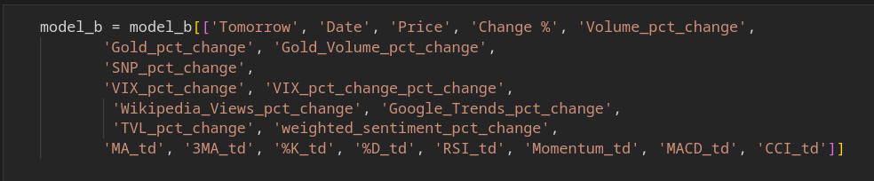
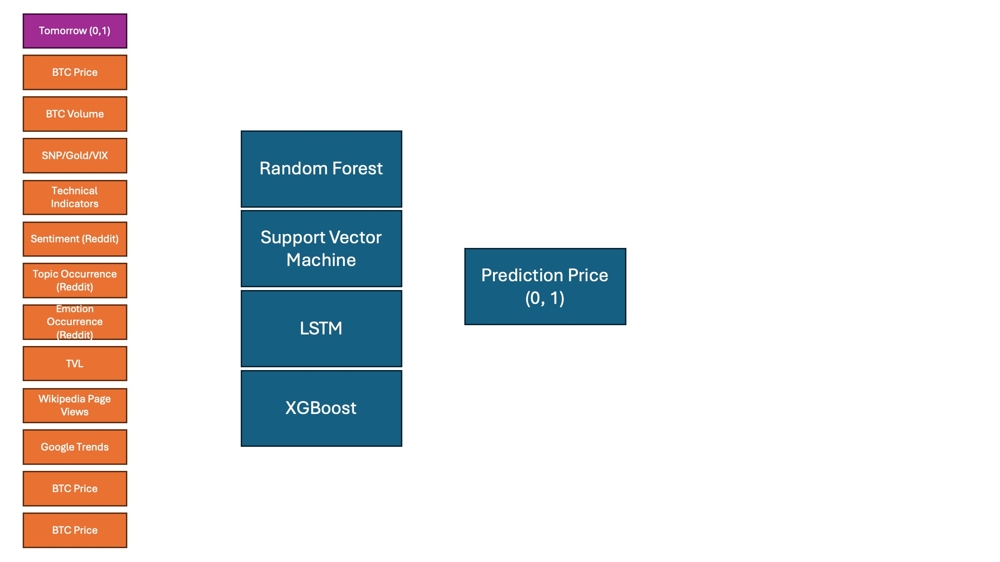
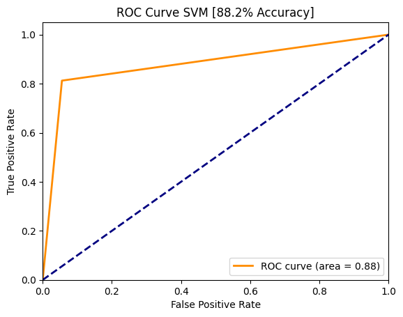
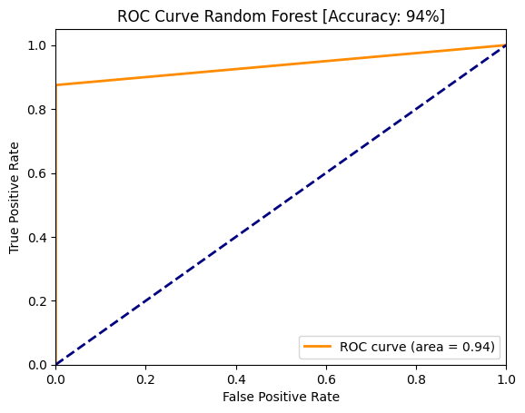
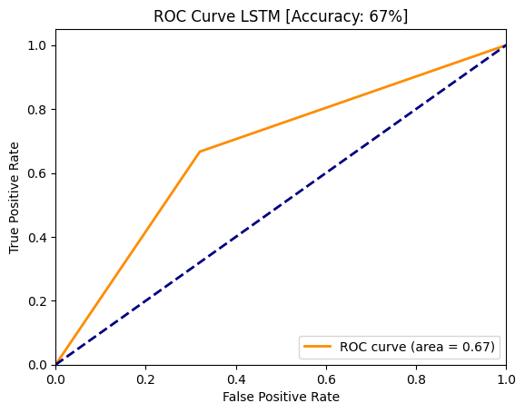
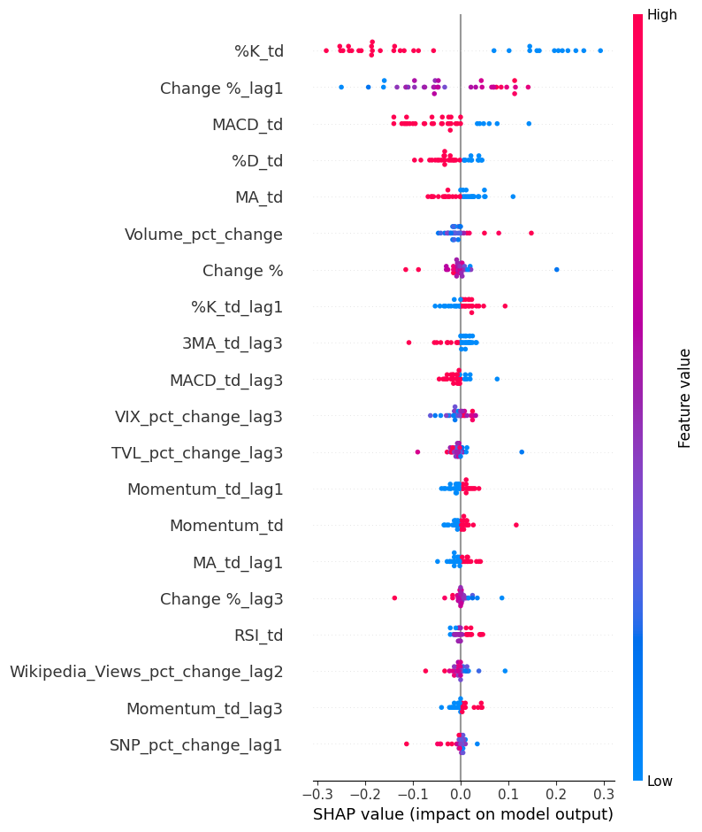

# Predicing BTC, ETH, and SOL Prices using multivariate feature set inlcuding social media sentiment analysis: A machine learning approach

- [Predicing BTC, ETH, and SOL Prices using multivariate feature set inlcuding social media sentiment analysis: A machine learning approach](#predicing-btc-eth-and-sol-prices-using-multivariate-feature-set-inlcuding-social-media-sentiment-analysis-a-machine-learning-approach)
  - [Literature Review](#literature-review)
    - [Efficient market hypothesis](#efficient-market-hypothesis)
    - [Past attempts at predicting the stock/crypto currency market](#past-attempts-at-predicting-the-stockcrypto-currency-market)
    - [Social Media and Sentiment Analysis in the Role of Predicting Stock/Crypto Prices](#social-media-and-sentiment-analysis-in-the-role-of-predicting-stockcrypto-prices)
    - [Conclusion](#conclusion)
  - [Data](#data)
    - [1. Historic Prices](#1-historic-prices)
    - [2. Google Trends](#2-google-trends)
    - [3. Wikipedia Page Views](#3-wikipedia-page-views)
    - [4. Technical Indicators and Trading Signals](#4-technical-indicators-and-trading-signals)
      - [Moving Averages](#moving-averages)
        - [10-Day Moving Average (10D MA)](#10-day-moving-average-10d-ma)
        - [Trading Signal for 10D MA](#trading-signal-for-10d-ma)
        - [30-Day Moving Average (30D MA)](#30-day-moving-average-30d-ma)
        - [Trading Signal for 30D MA](#trading-signal-for-30d-ma)
      - [Stochastic Oscillator (%K and %D)](#stochastic-oscillator-k-and-d)
        - [%K Calculation](#k-calculation)
        - [Trading Signal for %K](#trading-signal-for-k)
        - [%D Calculation](#d-calculation)
        - [Trading Signal for %D](#trading-signal-for-d)
      - [Relative Strength Index (RSI)](#relative-strength-index-rsi)
        - [RSI Calculation](#rsi-calculation)
        - [Trading Signal for RSI](#trading-signal-for-rsi)
      - [Momentum](#momentum)
        - [Momentum Calculation](#momentum-calculation)
        - [Trading Signal for Momentum](#trading-signal-for-momentum)
      - [Moving Average Convergence Divergence (MACD)](#moving-average-convergence-divergence-macd)
        - [MACD Calculation](#macd-calculation)
        - [Trading Signal for MACD](#trading-signal-for-macd)
      - [Commodity Channel Index (CCI)](#commodity-channel-index-cci)
        - [CCI Calculation](#cci-calculation)
        - [Trading Signal for CCI](#trading-signal-for-cci)
    - [5. Reddit Posts](#5-reddit-posts)
    - [6. TVL](#6-tvl)
  - [Methadology](#methadology)


## Literature Review

Predicting stock prices is not only multifaceted but also regarded as one of the most challenging applications of time-series analysis (Kara et al., 2011). Despite the extensive empirical research on predicting stock prices, the literature specifically addressing crypto stock price predictions remains significantly less developed. Accurate and robust stock price predictions are of utmost importance for developing effective trading strategies (Leung, Daouk, & Chen, 2000).

This literature review will focus on past works and attempts at predicting both stock and cryptocurrency prices. We will also delve into the theoretical backgrounds regarding the feasibility of predicting stock prices, examining past attempts by analyzing their methodologies and the machine learning (ML) and deep learning (DL) methods employed. These papers utilized nuanced feature sets, including various market variables. Therefore, we will review literature that explores which feature sets were used and why.
Additionally, this review aims to shed light on the impact of marketing-related variables on the predictive power of stock and crypto markets. In particular, we will investigate the influence of social media sentiment, such as Reddit discussions, on cryptocurrency prices. This comprehensive review seeks to provide a deeper understanding of the methodologies and variables that contribute to the predictability of financial markets.

### Efficient market hypothesis
Eugene Fama's Efficient Market Hypothesis (EMH) asserts that stock prices reflect all available information, implying that they always trade at their fair value. Fama (1970) argues that since all new information is immediately incorporated into stock prices, consistently predicting market movements or outperforming the market through traditional stock-picking is essentially impossible. This underpins the argument for passive index fund investing, which aims to match market returns rather than exceeding them.

Behavioral finance challenges Eugene Fama's Efficient Market Hypothesis by arguing that psychological factors and irrational behavior of investors can lead to market inefficiencies. Scholars like Daniel Kahneman and Amos Tversky, who develop prospect theory, demonstrate that cognitive biases such as overconfidence and loss aversion significantly influence investor decisions, often leading to predictable and systematic errors. Kahneman and Tversky (1979) mention that these biases cause stock prices to deviate from their true values, creating opportunities for superior returns through strategic trading, contrary to EMH’s assertion that such opportunities are fleeting or non-existent. Behavioral finance thus provides a framework to understand why and how markets might not be entirely efficient.

In 2022, Ho-Jun Kang and his colleagues conduct research to investigate the presence of the Efficient Market Hypothesis (EMH) in the cryptocurrency market. Their study involves testing 893 cryptocurrencies, and the results reveal that only a small fraction of these currencies adhere to the EMH. Specifically, Kang et al. (2022) find that only 54 cryptocurrencies (6%) follow the weak-form EMH, and just 24 (3%) adhere to the semi-strong-form EMH. These findings suggest that the cryptocurrency market demonstrates limited efficiency in information processing. Moreover, the study concludes that most cryptocurrencies do not incorporate past prices or new information into their market prices.

In 2020, Vu Le Tran authors a paper examining the Efficient Market Hypothesis (EMH) within the cryptocurrency market. Tran (2020) concludes that market efficiency is highly variable over time, particularly noting significant inefficiencies before 2017. Tran observes that, over time, the cryptocurrency market is becoming increasingly efficient. Among the cryptocurrencies tested, Litecoin emerges as the most efficient, while Ripple is identified as the least efficient.

### Past attempts at predicting the stock/crypto currency market 
In the study conducted by Kara, an artificial neural network (ANN) and support vector machine (SVM) are employed to predict stock price movements on the Istanbul Stock Exchange. The independent variable in this research is a binary indicator reflecting whether the stock price will move up or down the following day. Kara (2011) finds that the SVM, particularly with a polynomial activation function, outperforms all other algorithms, including ANN and backpropagation network (BPN), achieving an accuracy of 71.5%. The feature set for this study comprises various technical analysis (TA) indicators such as the Moving Average Convergence Divergence (MACD), Moving Average (MA), and the stochastic oscillator %K (K%).

In another study focusing on trend deterministic data for stock price prediction, a classification model is used to forecast the up or down movement of stock prices. Patel (2015) mentions that this research incorporates a feature set consisting of binary variables indicating whether a technical indicator suggests an upward or downward trend. The highest performing model in this study is the random forest, which achieves an accuracy of 83.5%. However, a noted limitation of this approach is the binary nature of the technical indicators. The study suggests that incorporating additional levels to represent the degree of movement, such as 'slightly up', 'slightly down', and 'barely down', could enhance the model's accuracy.

In 2020, Chen conducts a study to predict Bitcoin prices using various machine learning methods, including logistic regression and long short-term memory (LSTM) networks. Chen (2020) finds that by utilizing 5-minute interval price data, the model achieves an accuracy of 66%, outperforming more complex neural network models. The feature set in this study is comprehensive, incorporating not only Bitcoin price data but also external factors such as gold spot prices, property and network data, as well as trading and market information.

In another study, Weng (2018) attempts to predict short-term stock prices using ensemble methods. The feature set in this research is diverse, comprising historical stock prices, well-known technical indicators, sentiment scores derived from published newspaper articles, trends in Google searches, and the number of visits to Wikipedia pages. The study demonstrates impressive results, predicting the next day's stock prices with a mean absolute percentage error (MAPE) of less than 1.5%. The best-performing algorithms in this research are boosted decision trees, including XGBoost and AdaBoost.

Usami et al. conduct a study to predict the Karachi Stock Exchange (KSE) using various machine learning algorithms. They employ a classification model to forecast whether the market will go up or down. The feature set for this study is extensive, including oil rates, gold and silver rates, interest rates, foreign exchange (FEX) rates, news and social media feeds, simple moving averages (SMA), and autoregressive integrated moving average (ARIMA) data. Usami et al. (Year) find that the best performing model is the multilayer perceptron (MLP), a type of artificial neural network (ANN), alongside support vector regression (SVR).

In 2022, Mailagaha Kumbure et al. conduct a comprehensive literature review on the application of machine learning and data used for stock market forecasting. This review examines a total of 138 articles related to machine learning in stock markets, providing a detailed overview of the models, markets, and feature sets used in these studies. Mailagaha Kumbure et al. (2022) highlight that the most used machine learning methods are neural networks, support vector machines/support vector regression (SVM/SVR), and fuzzy theories. Additionally, they note that most of these papers incorporate technical indicators in their feature sets.

### Social Media and Sentiment Analysis in the Role of Predicting Stock/Crypto Prices
The influence of social media on Bitcoin prices has been a topic of significant interest in recent research. Feng Mai's 2018 study employs textual analysis and vector error corrections to demonstrate a clear link between social media sentiment and Bitcoin price movements. Mai (2018) shows that bullish posts on social media platforms are associated with higher future Bitcoin prices. This suggests that social media sentiment is a valuable predictor of Bitcoin price fluctuations, highlighting the impact of public opinion and social discourse on cryptocurrency markets.

In addition to social media, online search activity also correlates with Bitcoin price movements. Kristoufek (2013) analyzes Google Trends and Wikipedia page visits, finding strong correlations between these data points and Bitcoin prices. This research suggests that increased online searches and Wikipedia activity, reflecting public interest and awareness, can significantly influence Bitcoin market trends. Complementing these findings, Wesley S. Chan's 2003 study on stock market prediction through news sentiment reveals that positive newspaper headlines often lead to overvaluation of stocks, while negative headlines result in undervaluation. Chan (2003) further notes that this sentiment effect is more pronounced in smaller market capitalization stocks and that investors typically react slowly to sentiment changes. Together, these studies underscore the significant role of public sentiment, whether expressed through social media, search activity, or news headlines, in influencing financial markets.

The predictive power of social media sentiment on cryptocurrency prices has been further explored in recent studies. Olivier Kraaijeveld's 2020 research focuses on the influence of Twitter sentiment on the returns of major cryptocurrencies. Kraaijeveld (2020) concludes that Twitter sentiments indeed have predictive power over cryptocurrency prices, utilizing a lexicon-based sentiment analysis. The study highlights that news disseminated through Twitter can rapidly alter investor sentiments, leading to immediate and significant price movements. This finding emphasizes the crucial role of real-time sentiment analysis in anticipating market trends and price fluctuations in the volatile cryptocurrency market.

Similarly, news sentiment shows a notable impact on Bitcoin prices. Lavinia Rognone's 2020 study analyzes the effect of unscheduled news on Bitcoin compared to traditional currencies using intra-day data from January 2012 to November 2018. Rognone (2020) finds that Bitcoin often reacts positively to news, whether positive or negative, indicating a high level of enthusiasm among investors towards Bitcoin, unlike traditional stock markets. However, specific negative news, such as reports of fraud and cyber-attacks, have adverse effects on Bitcoin prices. The study utilizes RavenPack's real-time news data and employs a Vector Auto-Regressive Exogenous (VARX) model for the analysis. In parallel, Wasit Khan's 2020 research combines social media and news sentiment to predict stock market movements, using a dataset from Twitter and Yahoo Finance. Khan (2020) demonstrates that their predictive model achieves an accuracy of 80% after filtering out spam tweets, underscoring the significant impact of integrated sentiment analysis on market predictions. These studies collectively highlight the importance of sentiment analysis in understanding and forecasting market dynamics across various financial assets.


### Conclusion
The literature review underscores the multifaceted and challenging nature of predicting stock and cryptocurrency prices, emphasizing the importance of robust predictions for effective trading strategies. Research on stock price prediction is extensive, utilizing various machine learning (ML) and deep learning (DL) methods. Studies such as those by Kara et al. (2011) and Patel (2015) highlight the effectiveness of SVM and random forest models, respectively, in forecasting stock prices using technical indicators. Similarly, Chen (2020) and Weng (2018) demonstrate the predictive power of logistic regression, LSTM networks, and ensemble methods for Bitcoin and stock prices, leveraging comprehensive feature sets that include market variables and sentiment scores. The review also notes the evolving efficiency of cryptocurrency markets, with studies like those by Kang et al. (2022) and Tran (2020) revealing limited adherence to the Efficient Market Hypothesis (EMH), indicating significant information processing inefficiencies.
The impact of sentiment analysis on market predictions emerges as a critical theme. Research by Mai (2018) and Kraaijeveld (2020) establishes the predictive power of social media sentiment on cryptocurrency prices, while Kristoufek (2013) and Chan (2003) demonstrate similar effects for online search activity and news sentiment on Bitcoin and stock markets. Studies such as Rognone (2020) and Khan (2020) further validate the significant influence of real-time sentiment, integrating social media and news data to achieve high prediction accuracy. These findings collectively highlight the importance of incorporating diverse feature sets, including sentiment analysis, to enhance the predictability of financial markets and challenge traditional notions of market efficiency.


## Data
This section details the datasets and technical indicators used for the machine learning algorithms to predict the next day's classification of BTC, ETH, and SOL prices. The datasets include historic prices, Google Trends, Wikipedia page views, and top 100 Reddit posts for sentiment analysis and topic modeling. Additionally, several technical indicators are engineered from the main price data tables.

### 1. Historic Prices
For BTC, ETH, and SOL, we collected historic prices with the following attributes:

- Price: The closing price of the cryptocurrency.
- Open: The opening price.
- High: The highest price during the trading period.
- Low: The lowest price during the trading period.
- Close: The closing price.
- Volume: The trading volume.
- Pct Change: The percentage change in price.

### 2. Google Trends
Google Trends data is collected for BTC, ETH, and SOL to understand the relative search interest over time. This data helps gauge public interest and potential market movements.

### 3. Wikipedia Page Views
Wikipedia page views for BTC, ETH, and SOL are used to measure the general public's interest in these cryptocurrencies. This data serves as a proxy for market sentiment and public awareness.

### 4. Technical Indicators and Trading Signals

This project includes various technical analysis indicators calculated using pandas. Below are the formulas used for each indicator, formatted for clarity.

#### Moving Averages
##### 10-Day Moving Average (10D MA)

<p align="center">
  
</p>

##### Trading Signal for 10D MA
<p align="center">
  
</p>

The 10-Day Moving Average (10D MA) smooths out short-term price fluctuations to reveal trends. A price above the 10D MA suggests upward momentum, signaling a potential buy opportunity. This signal makes sense because it indicates that recent prices are higher than the average of the last 10 days, often a bullish indicator.

##### 30-Day Moving Average (30D MA)

<p align="center">
  
</p>

##### Trading Signal for 30D MA
<p align="center">
  
</p>

The 30-Day Moving Average (30D MA) is used to gauge medium-term price trends. When the price is above the 30D MA, it indicates that the market is experiencing an upward trend, which can be a buy signal. This makes sense as it reflects sustained positive momentum over a longer period compared to the 10D MA.

#### Stochastic Oscillator (%K and %D)

##### %K Calculation
<p align="center">
  
</p>

##### Trading Signal for %K
<p align="center">
  
</p>

The %K of the Stochastic Oscillator compares a stock's closing price to its price range over a specified period, usually 10 days. An upward %K signal indicates that the current price is closing near the high of the range, suggesting buying pressure. This is seen as a bullish indicator since it shows the stock's strength relative to its recent trading range.

##### %D Calculation
<p align="center">
  
</p>

##### Trading Signal for %D
<p align="center">
  
</p>

The %D is a 3-day moving average of %K, providing a smoothed line to identify the trend. An upward %D signal shows that the %K line is increasing over several days, indicating continued buying interest. This makes sense as a bullish indicator because it confirms the momentum shown by the %K line over a more extended period.

#### Relative Strength Index (RSI)

##### RSI Calculation
<p align="center">
  
</p>

##### Trading Signal for RSI
<p align="center">
  
</p>

The RSI measures the speed and change of price movements on a scale of 0 to 100. An RSI above 70 indicates overbought conditions, signaling a potential sell opportunity, while an RSI below 30 indicates oversold conditions, suggesting a buy. These signals make sense because they identify extreme price conditions where a reversal is likely.

#### Momentum

##### Momentum Calculation
<p align="center">
  
</p>

##### Trading Signal for Momentum
<p align="center">
  
</p>

Momentum measures the rate of change of a stock's price. A positive momentum signal indicates that the current price is significantly higher than the price 10 days ago, suggesting a strong upward trend. This is a bullish signal as it reflects accelerating price increases, often leading to further gains.

#### Moving Average Convergence Divergence (MACD)

##### MACD Calculation
<p align="center">
  
</p>

##### Trading Signal for MACD
<p align="center">
  
</p>

The MACD indicates the relationship between two moving averages of a stock's price. An upward MACD signal suggests that the short-term moving average is rising faster than the long-term average, indicating bullish momentum. This makes sense as a buy signal because it shows increasing positive sentiment and potential for further gains.

#### Commodity Channel Index (CCI)

##### CCI Calculation
<p align="center">
  
</p>

##### Trading Signal for CCI
<p align="center">
  
</p>

The CCI measures the difference between a stock's typical price and its moving average, normalized by mean absolute deviation. A CCI above 100 indicates overbought conditions, suggesting a sell, while below -100 indicates oversold conditions, suggesting a buy. These signals are logical as they help identify extreme price levels where reversals are likely.


### 5. Reddit Posts
Top 100 Reddit posts per respective cryptocurrency subreddit (BTC, ETH, SOL) are collected. The data includes:

- Title: The title of the post.
- Description: A brief description of the post.
- Date Posted: The date the post was published.
- Number of Likes: The number of likes the post received.
- Number of Comments: The number of comments on the post.
- Overall Score: The overall score of the post.

This data will be used for sentiment analysis and topic modeling to gain insights into community sentiment and trending topics.

### 6. TVL
Total Value Locked (TVL) is a crucial metric in the cryptocurrency and decentralized finance (DeFi) space, representing the total capital held within a specific protocol, encompassing all the assets staked, loaned, or otherwise utilized. Analyzing daily TVL data in dollars for Bitcoin, Ethereum, and Solana, this metric provides insightful analytics on market confidence and the overall health of these blockchain ecosystems. By tracking TVL, one can gauge user engagement and investment trends, helping to identify which protocols are gaining or losing traction. 

From a marketing perspective, TVL serves as a compelling indicator of a platform’s credibility and growth potential, attracting more users and investors. Higher TVL figures often correlate with increased media coverage and user interest, thereby enhancing the marketing appeal and perceived stability of the platform. Analyzing TVL trends can also help marketers tailor their strategies to capitalize on emerging opportunities within the crypto market.

### 7. Gold, SNP, and Vix Historic Data
Three distinct datasets: Gold, S&P 500 (SNP), and VIX historical data. Each dataset includes crucial financial metrics such as price, open, high, low, close, and volume (where applicable), which provide a comprehensive view of the market dynamics and facilitate the development of predictive models.

- Gold Data: This dataset encompasses historical data on gold prices, including the opening, high, low, and closing prices. Gold is a significant asset in the financial markets, often considered a safe-haven investment. The dataset helps in understanding the price movements and volatility associated with gold over time.

- S&P 500 (SNP) Data: The S&P 500 dataset includes historical data for this widely followed stock market index. It covers the opening, high, low, and closing prices, as well as the trading volume. The S&P 500 is a key indicator of the overall performance of the U.S. stock market and is used to gauge economic conditions and investor sentiment.

- VIX Data: The VIX, also known as the CBOE Volatility Index, measures market expectations of near-term volatility conveyed by S&P 500 stock index option prices. This dataset includes the VIX's historical prices, providing insights into market volatility and risk. The VIX is often referred to as the "fear gauge" of the market, as it reflects investor uncertainty and market sentiment.

### Final Data Set
Here's an overview of the final dataset that will ultimately be fed into the models. 

<p align="center">
  
</p>

## Methadology

<p align="center">
  
</p>


## Introduction

This study employs a comparative analysis of three machine learning models to predict Bitcoin price movements:

1. Random Forest Classification
2. Support Vector Machine (SVM)
3. Long Short-Term Memory (LSTM) Classification

Our primary objective is to evaluate and compare the performance of these models in forecasting whether the Bitcoin price will increase or decrease on the following day, based on historical price data and other relevant features.

#### Dataset

The dataset utilized in this study comprises various features derived from historical Bitcoin price data, including but not limited to:

- Opening price
- Closing price
- Trading volume
- Price volatility measures

The dependent variable is a binary indicator (0 or 1) representing whether the Bitcoin price will rise the next day, making this a binary classification problem.

#### Model Overview

Each model brings unique strengths to the task:

1. **Random Forest Classification**: Offers robustness against overfitting and the ability to handle non-linear relationships.
2. **Support Vector Machine**: Excels in high-dimensional spaces and is effective when the number of dimensions exceeds the number of samples.
3. **LSTM Classification**: Particularly suited for sequential data, capturing long-term dependencies in time series.

### Support Vector Machine (SVM)

Support Vector Machine is a powerful supervised learning algorithm used for both classification and regression tasks. In our study, we employ SVM for binary classification to predict Bitcoin price movements.

#### Theoretical Foundation

SVM operates on the principle of finding the optimal hyperplane that best separates the two classes in the feature space. In our case, these classes represent whether the Bitcoin price will increase (1) or not (0) the following day.

The optimal hyperplane is determined by maximizing the margin between the two classes. The margin is defined as the distance between the hyperplane and the nearest data point from either class, known as support vectors.

Mathematically, this can be expressed as an optimization problem:

```
minimize:
    (1/2)||w||^2

subject to:
    y_i(w^T x_i + b) ≥ 1,  for i = 1, ..., n
```

Where:
- $w$ is the normal vector to the hyperplane
- $x_i$ are the training examples
- $y_i$ are the class labels (-1 or 1)
- $b$ is the bias term

#### Kernel Trick

One of the key strengths of SVM is its ability to handle non-linear decision boundaries through the use of kernel functions. The kernel trick allows SVM to operate in a high-dimensional feature space without explicitly computing the coordinates of the data in that space.

Common kernel functions include:

1. Linear: 
   $K(x_i, x_j) = x_i^T x_j$

2. Polynomial: 
   $K(x_i, x_j) = (\gamma x_i^T x_j + r)^d$

3. Radial Basis Function (RBF): 
   $K(x_i, x_j) = \exp(-\gamma \|x_i - x_j\|^2)$

In our study, we experimented with different kernel functions to determine the most effective for our Bitcoin price prediction task.

#### Hyperparameter Tuning

To optimize the SVM model's performance, we conducted hyperparameter tuning using grid search with cross-validation. The key hyperparameters tuned include:

- **C**: The regularization parameter, controlling the trade-off between achieving a low training error and a low testing error.
- **Kernel**: The type of kernel function used (linear, polynomial, RBF).
- **Gamma**: The kernel coefficient for RBF and polynomial kernels.
- **Degree**: The degree of the polynomial kernel function (if used).

#### Implementation

We implemented the SVM model using the scikit-learn library in Python. The general process followed these steps:

1. Data preprocessing: Scaling features to a common range (e.g., [0, 1]) to ensure all features contribute equally to the model.
2. Splitting the data into training and testing sets.
3. Performing grid search with cross-validation to find optimal hyperparameters.
4. Training the SVM model with the best hyperparameters on the entire training set.
5. Evaluating the model's performance on the test set using metrics such as accuracy, precision, recall, and F1-score.

By leveraging SVM's ability to handle high-dimensional data and capture complex decision boundaries, we aim to accurately predict Bitcoin price movements based on historical data and derived features.

### Random Forest Classification

Random Forest is an ensemble learning method that operates by constructing multiple decision trees during training and outputting the class that is the mode of the classes (classification) of the individual trees. In our study, we employ Random Forest for binary classification to predict Bitcoin price movements.

#### Theoretical Foundation

Random Forest builds upon the concept of decision trees, combining many trees to form a "forest". Each tree in the forest is built from a bootstrap sample of the training data, and at each node, a random subset of features is considered for splitting. This randomness helps to decorrelate the trees and make the forest more robust to overfitting.

The algorithm can be summarized as follows:

1. Create $n$ bootstrap samples of the original dataset.
2. For each sample, grow a decision tree:
   a. At each node, randomly select $m$ features from the total $M$ features.
   b. Split the node using the feature that provides the best split according to the objective function, typically Gini impurity or information gain.
   c. Repeat the above steps until a stopping criterion is met (e.g., minimum node size).
3. For classification, the final prediction is the majority vote of all trees.

#### Key Advantages

1. **Robustness to Overfitting**: By averaging multiple decision trees, Random Forest reduces the risk of overfitting.
2. **Feature Importance**: It provides a measure of feature importance, helping in feature selection and interpretation.
3. **Handles Non-linearity**: Can capture complex, non-linear relationships in the data.
4. **Minimal Hyperparameter Tuning**: Often performs well even with default hyperparameters.

#### Hyperparameter Tuning

While Random Forest can perform well with default settings, we conducted hyperparameter tuning to optimize performance. Key hyperparameters include:

- **n_estimators**: The number of trees in the forest.
- **max_depth**: The maximum depth of each tree.
- **min_samples_split**: The minimum number of samples required to split an internal node.
- **min_samples_leaf**: The minimum number of samples required to be at a leaf node.
- **max_features**: The number of features to consider when looking for the best split.

We used grid search with cross-validation to find the optimal combination of these hyperparameters.

#### Implementation

We implemented the Random Forest model using the scikit-learn library in Python. The process followed these steps:

1. Data preprocessing: Handling missing values, encoding categorical variables, and scaling numerical features if necessary.
2. Splitting the data into training and testing sets.
3. Performing grid search with cross-validation to find optimal hyperparameters.
4. Training the Random Forest model with the best hyperparameters on the entire training set.
5. Evaluating the model's performance on the test set using metrics such as accuracy, precision, recall, and F1-score.
6. Analyzing feature importance to understand which factors most influence Bitcoin price movements.

By leveraging Random Forest's ability to handle complex relationships and provide insights into feature importance, we aim to accurately predict Bitcoin price movements and gain a deeper understanding of the factors that influence these movements.

## Results
In this study, we evaluated the performance of three machine learning models: Random Forest Classification (RFC), Support Vector Classification (SVC), and Long Short-Term Memory (LSTM) neural networks. The Random Forest model demonstrated the highest performance, achieving an accuracy of 94%. The Support Vector Classification model followed, with an accuracy of 88%. For both the Random Forest and Support Vector Classification models, we incorporated a lag of three days to account for time series data.

The LSTM neural network, with an architecture comprising an input layer, a hidden layer with 100 units, another hidden layer with 50 units, and a single output unit, achieved an accuracy of 69%. Despite the lower accuracy compared to the RFC and SVC models, the LSTM's performance is noteworthy given the complexity of the time series data it was designed to handle.

ROC Curves for all the models
<div style="display: flex; justify-content: center;">
  
  
  
</div>

### Global Interpretation: SHAPley Values
A SHAP bee plot is a visualization tool used to interpret machine learning models by displaying the impact of each feature on the model's output. SHAP (SHapley Additive exPlanations) values are based on cooperative game theory and provide a way to understand how individual features contribute to a prediction.

**Components of the SHAP Bee Plot**
- Features: Listed on the y-axis, these are the input variables used by the model. In the context of predicting Bitcoin's price, features include various technical indicators, percentage changes, and momentum indicators.

- SHAP Values: Represented on the x-axis, SHAP values show the impact of each feature on the model's prediction. A positive SHAP value indicates that the feature pushes the prediction towards a higher value (in this case, predicting a price increase), while a negative SHAP value suggests the opposite.

- Color Gradient: The color of the dots represents the actual value of the feature, with a gradient from blue (low value) to red (high value). This helps in understanding how different values of a feature influence the prediction.

- Dots and Spread: Each dot represents a SHAP value for a specific instance in the dataset. The spread of dots along the x-axis shows the distribution of the feature's impact. A wider spread indicates a more variable impact on the model's output.

<p align="center">
  
</p>

**Key Insights from the SHAP Bee Plot**
Top Features Impacting Prediction:


#### %K_td (Stochastic Oscillator Indicator - %K)
High %K_td values (red dots), typically indicating a bullish signal, are inversely related to price prediction, suggesting a price decrease. Conversely, low %K_td values (blue dots) correlate with predicting price increases.

##### Change %_lag1
Higher values of Change %_lag1 (red dots) positively influence the prediction, indicating that if Bitcoin's price increased yesterday, it is more likely to increase again tomorrow. Conversely, lower values (blue dots) suggest a potential price drop.

#### MACD_td (Moving Average Convergence Divergence)
High MACD_td values (red dots), usually signaling a bullish trend, inversely relate to predicting a price decrease. Lower MACD_td values (blue dots) suggest an upward price prediction.

#### %D_td (Stochastic Oscillator Indicator - %D)
High %D_td values (red dots) indicate a bullish signal but are inversely correlated with the price prediction, suggesting a price decrease. Low %D_td values (blue dots) correlate with predicting a price increase.

##### MA_td (Moving Average)
High MA_td values (red dots), typically indicating an upward trend, are inversely related to price prediction, suggesting a price decrease. Low MA_td values (blue dots) indicate a downward trend but predict a price increase.